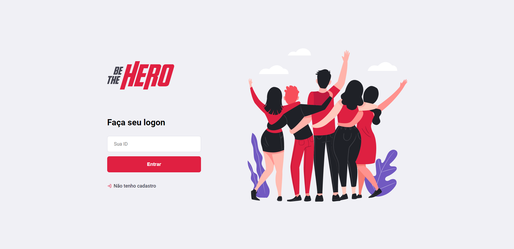
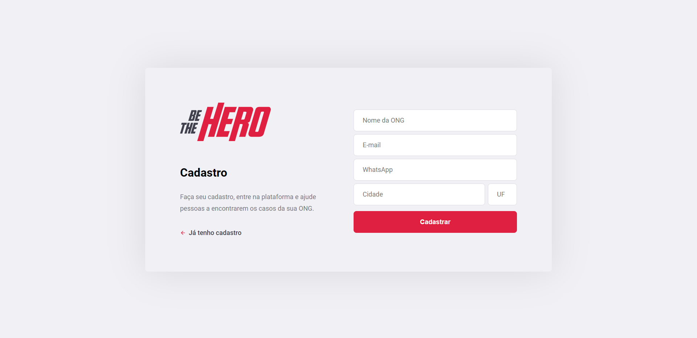
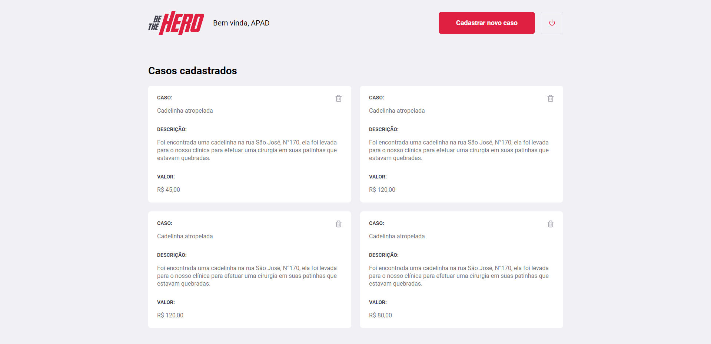
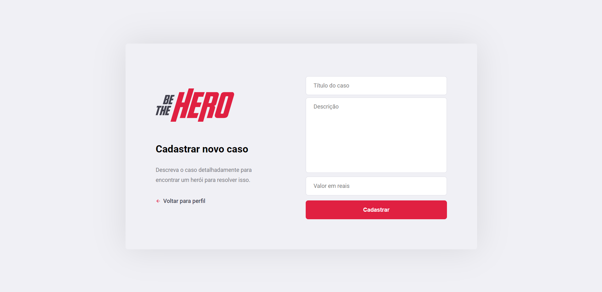

# Be the Hero

Aplicação desenvolvida com intuito de fornecer mídia e ajuda financeira para Organizações Não Governamentais espalhadas pelo mundo, permitindo que os visitantes fiquem por dentro das ações em incidentes tomadas por estas ONGs e entrem em contato para fornecer ajuda de forma solidária.

## Capturas de Tela

- Web:

;

;

;

;

## Entidades

- ONGs (_NGOs_);
- Incidentes (_Incidents_)

## Funcionalidades

- Web:
  - Cadastro de ONGs;
  - Autenticação de ONGs;
  - Inclusão de incidentes;
  - Remoção de incidentes;
  - Listagem dos incidentes de uma ONG.
- Mobile:
  - Listagem dos incidentes cadastrados;
  - Disponibilizar contato com a ONG (via Whatsapp/E-mail).
